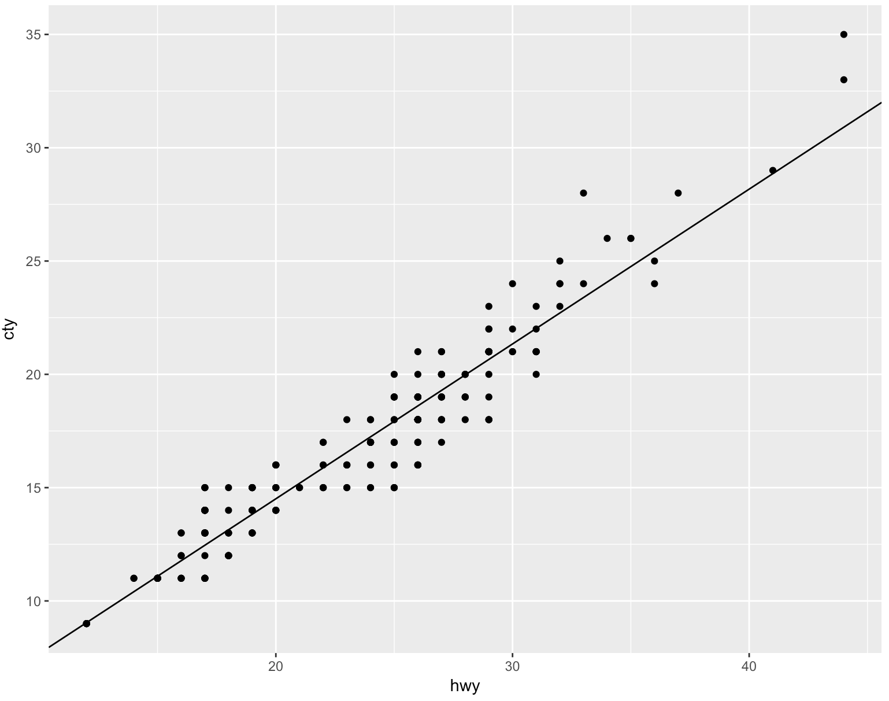
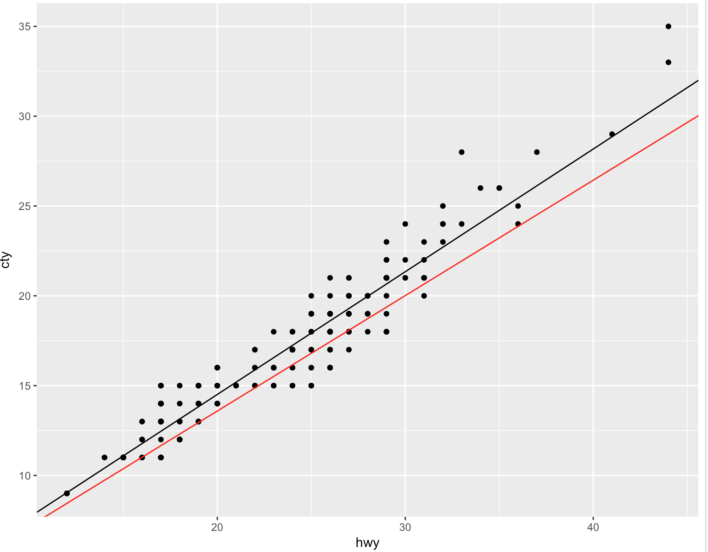

# gdlm
Gradient Descent for Linear Models in R

Perform gradient descent to build linear models and use bootstrapping to generate standard errors on estimators. Motivation for this project is that in practice, loss functions for regressions are rarely symmetric, yet most prevalent regression tools in R assume symmetry with no configurability otherwise. Goal is to provide flexibility in loss function specification combined with general ease of use associated with other linear models in R.
## Installation
```
devtools::install_git('https://github.com/holub008/gdlm')
```

## Examples
### Asymmetric loss for least squares
Here we fit an OLS model predicting city mpg from highway mpg on the mpg dataset from ggplot:
```
data(mpg)
(p1 <- ggplot(mpg) + geom_point(aes(hwy, cty)))

m <- gdlm(cty ~ hwy, mpg, loss = LS_LOSS())
summary(m)
(p2 <- p1 + geom_abline(aes(intercept = m$estimators[1],
                            slope = m$estimators[2]), color = 'black'))
```
with results:
```
[1] "Formula: cty ~ hwy"
[1] "Esimators:"
             Estimate Standard Error        5%       95%
(Intercept) 0.8416769      0.3737633 0.2760343 1.4903538
hwy         0.6832955      0.0164563 0.6570886 0.7089135
```


If we have a prediction problem where overpredictions are more heavily penalized than underpredictions, we parameterize our loss function as:
```
m_negative_penalty <- gdlm(cty ~ hwy, mpg, loss = LS_LOSS(loss_asymmetry = .1))

p2 + geom_abline(aes(intercept = m_negative_penalty$estimators[1],
                     slope = m_negative_penalty$estimators[2]), color ='red')
```


In practice the loss asymmetry would likely be determined through a cross validation. Note that loss asymmetry can similarly be applied to logistic loss functions.

### Elastic net regularized logistic regression
```
car_data <- mpg
car_data$is_big_car <- mpg$class %in% c('suv', 'pickup', 'minivan')

m_log <- gdlm(is_big_car ~ hwy, car_data, loss = LOGISTIC_LOSS())
summary(m_log)

log_odds <- predict(m_log)
ggplot() + geom_histogram(aes(log_odds, fill = car_data$is_big_car))

m_log_shrunk <- gdlm(is_big_car ~ hwy, car_data,
                     loss = compose_regularization(LOGISTIC_LOSS(), elastic_net_parameter = .5, lambda = 1e-3))
summary(m_log_shrunk)

log_odds <- predict(m_log_shrunk)
ggplot() + geom_histogram(aes(log_odds, fill = car_data$is_big_car))
```

